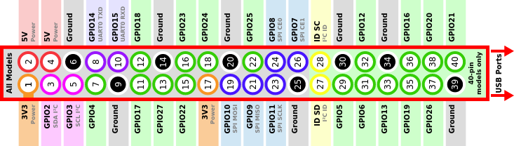

# Termalizator - Make you food great again! :fire: :ok_hand:
DS18B20 temperature sensor project

## Raspberry pinout
Follow highlighted by red color center numbers!

We recommend to set output pin to 16.

## Scheme of heating driver

## <a href="./docs/install.md">Install manual</a>

